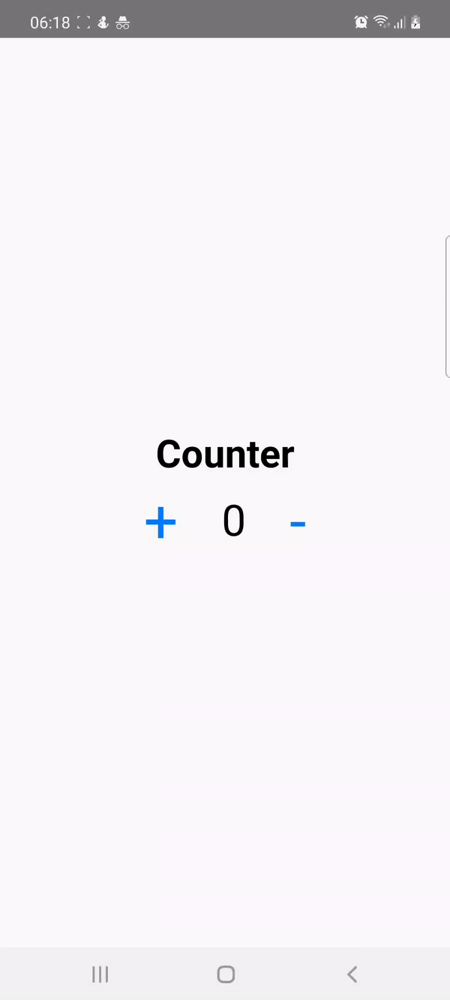

# redux-saga-counter-example
A simple React Native app to demonstrate use of Redux Saga for running asynchronous scenarios in background mode and return result to the Component View.



## Install and run on android
```
$ npm install -g react-native-cli // assuming you don't have it installed globally in your machine
$ cd redux-saga-counter-example
$ npm install
$ npx react-native run-android
```

## Install and run on ios
```
$ npm install -g react-native-cli // assuming you don't have it installed globally in your machine
$ cd redux-saga-counter-example
$ npm install
$ npx react-native run-ios
```

## reference 
[React Native + Redux: Implementing Redux Saga For An Asynchronous Flow](https://levelup.gitconnected.com/react-native-redux-implementing-redux-saga-for-an-asynchronous-flow-90a0e9d7d8e8)